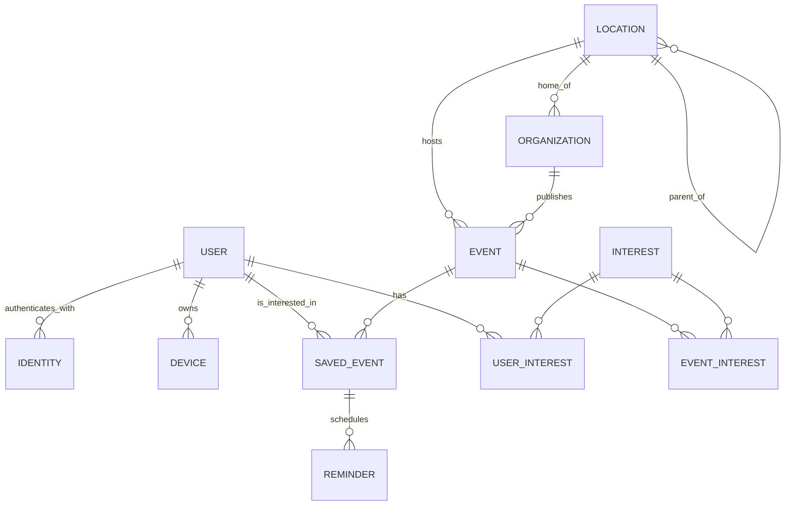

# Data model (draft)

> Conceptual draft for the MVP. Final table/column names are fixed when scaffolding
> `apps/api`. Names in **English** (code convention).

## Entities

### Location — hierarchical

Represents a geographic place. It is **self-referential (hierarchical)** to support
future neighborhood filtering without reworking the schema:

- `municipality` level → **the pilot location** (a small town in Spain; the only active one in the MVP).
- `district`/`neighborhood` level → **neighborhoods** of large cities (future).

Key fields:

- `id`
- `name`
- `slug`
- `kind` (enum: `municipality`, `district`, `neighborhood`, …)
- `parent_id` (FK to `Location`, nullable) → builds the tree.
- `latitude`, `longitude` (optional)
- `timezone` (e.g. `Europe/Madrid`)

> **Prepared for neighborhoods:** an event is associated with the most specific `Location`
> that applies. Filtering "an entire city" = the location and **all its descendants**;
> filtering by a specific neighborhood = just that `Location`. In the MVP all events hang
> off the pilot municipality, but the mechanism already exists.

### Organization

Who publishes events. Only **manually verified** ones can publish.

- `id`, `name`, `slug`, `description`, `logo_url`, `contact_email`
- `verified_at` (nullable) → verified if not null.
- `home_location_id` (FK to `Location`)

### User

A person. Can browse **without** a `User` (anonymous); it is only created on first login.

- `id`, `email`, `display_name`, `avatar_url`
- `created_at`
- Relationship with interests (see `UserInterest`).
- Relationship with devices (see `Device`).

### Identity (access identity)

Decouples the user from how they authenticate (allows multiple providers per user).

- `id`, `user_id` (FK)
- `provider` (enum: `google`, `apple`, `email_magic_link`)
- `provider_uid`
- `email`
- Unique per (`provider`, `provider_uid`).

### Interest / Category

Catalog of event categories (sports, music, culture, festivals…). Used both to
**classify events** and to **model user interests**.

- `id`, `name`, `slug`, `icon`

### Event

The core of the wall.

- `id`, `title`, `description`
- `starts_at`, `ends_at` (nullable), `timezone`
- `location_id` (FK to `Location`) → specific location (municipality or, future, neighborhood).
- `venue_name`, `address`, `latitude`, `longitude` (optional, exact physical location)
- `organization_id` (FK to `Organization`)
- `status` (enum: `draft`, `published`, `cancelled`)
- `published_at` (nullable)
- N:M relationship with `Interest` (see `EventInterest`) to categorize and filter.

> **Wall ordering:** events with `status = published` and `starts_at >= now`, ordered by
> `starts_at` ascending, filterable by `location` (incl. descendants) and `interests`.

### SavedEvent

A user's mark that they are interested in an event. Triggers the reminders.

> **Entity name vs. visible label:** the entity is called `SavedEvent` on purpose — a
> **neutral, copy-independent** name. The user-facing label shown in the app (currently
> **"Me interesa"**) is presentation copy and can change over time (it started as
> "Quiero ir") without requiring a rename of the entity, its table, or its API fields.
> We avoided `EventInterest` for this entity because that name is already used for the
> `Event`↔`Interest` (category) join table below and would be confusing.

- `id`, `user_id` (FK), `event_id` (FK)
- `created_at`
- Unique per (`user_id`, `event_id`).
- Its creation **generates** the `Reminder`s; its deletion **cancels** them.

### Reminder

Scheduled push reminder, derived from a `SavedEvent`.

- `id`, `saved_event_id` (FK)
- `offset` (enum: `one_day_before`, `one_hour_before`)
- `scheduled_at` (computed from `event.starts_at`)
- `status` (enum: `pending`, `sent`, `cancelled`, `failed`)
- `sent_at` (nullable)

### Device (push device)

A user's notification token (for APNs/FCM).

- `id`, `user_id` (FK)
- `platform` (enum: `ios`, `android`)
- `push_token`
- `last_active_at`

## Join tables (N:M)

- **`UserInterest`**: `user_id` + `interest_id` → the user's interests (wall filter).
- **`EventInterest`**: `event_id` + `interest_id` → each event's categories.

## Relationships (summary)

- `Location` **1—N** `Location` (self-reference: `parent_id`) → municipality/neighborhood hierarchy.
- `Location` **1—N** `Event`.
- `Location` **1—N** `Organization` (home_location).
- `Organization` **1—N** `Event`.
- `User` **1—N** `Identity`, `Device`, `SavedEvent`, `UserInterest`.
- `Event` **N—M** `Interest` (via `EventInterest`).
- `User` **N—M** `Interest` (via `UserInterest`).
- `User` **N—M** `Event` (via `SavedEvent`, labeled "Me interesa" in the app).
- `SavedEvent` **1—N** `Reminder` (D-1 and H-1).

## Entity-relationship diagram

## How neighborhood filtering is prepared (future)

1. `Location` is **hierarchical** (`parent_id`), so "city → neighborhoods" is natural.
2. An `Event` points to the **most specific** `Location` possible.
3. Querying by a location = including **it and its descendants** (subtree).
4. In the MVP only the **pilot** municipality exists; enabling neighborhoods in the
   future is **adding** `Location` rows with a `parent_id`, with **no disruptive schema
   migration**.
