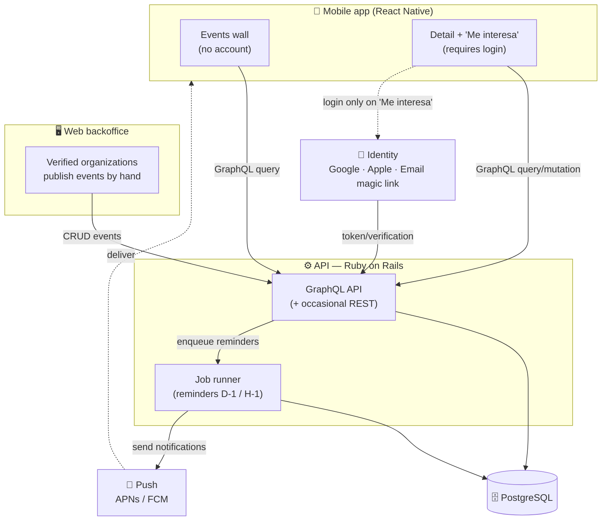

# Architecture — Overview

> **Lightweight**, _design-first_ document. It describes the shape of the system, not
> every detail. It will be refined when scaffolding `apps/mobile` and `apps/api`.

## Principles

- **Monorepo:** mobile app and backend in a single repo to share context, docs, and
  atomic versioning of changes that cross client/server.
- **Start simple:** one location, one backend, manual publishing. No scraping or AI.
- **Ready to grow:** the data model anticipates multi-location and neighborhood filtering
  without reworking the schema (see [`data-model.md`](./data-model.md)).

## Components

- **Mobile app (React Native):** iOS/Android client. Consumes the GraphQL API. Browses
  the wall without an account; asks for login only when tapping "Me interesa". Handles
  permissions and push reception.
- **API (Ruby on Rails + GraphQL):** business logic and data source. Exposes GraphQL for
  the app and serves the **web backoffice** for verified organizations. Schedules the
  delivery of reminders.
- **Database (PostgreSQL):** persistence. Chosen by default for its relational/geospatial
  support and its fit with Rails.
- **Job runner (async):** background jobs to **schedule and send** the push reminders
  (D-1 and H-1). Planned default: Solid Queue / Sidekiq.
- **Push provider:** notification service (APNs for iOS, FCM for Android), usually through
  a layer like Firebase Cloud Messaging.
- **Identity providers:** Google, Apple (Sign in with Apple), and email magic link.

## Diagram

## Why GraphQL

- **A rich wall with relationships:** event → organization → location → categories.
  GraphQL lets the client request exactly that graph in **a single request**, avoiding
  over/under-fetching and REST call cascades.
- **Efficient mobile client:** on mobile networks it matters to minimize requests and
  payloads; the client decides which fields each screen needs.
- **Schema as a typed contract:** the schema documents and validates the contract between
  the app and the backend, reducing friction between the two roles (PO/engineer) and
  easing evolution without breaking clients.
- **Evolution without URL versioning:** adding fields/types is additive; it fits a roadmap
  that will grow (multi-location, neighborhoods, etc.).

**Occasional REST** where it beats GraphQL: OAuth callbacks / magic-link verification,
webhooks, and health checks.

## Default decisions (to confirm at scaffolding)

- Database: **PostgreSQL**.
- GraphQL gem: **`graphql-ruby`**.
- Jobs: **Solid Queue** (or Sidekiq if we need advanced features).
- Mobile GraphQL client: **Apollo Client** (to validate against urql).
- The **backoffice** is served from the same Rails app (Rails full, not API-only), for
  MVP simplicity.
