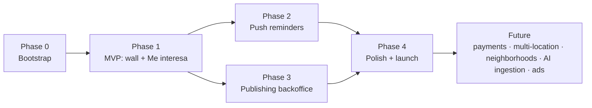

# Roadmap — LaPlaza

Milestone-based phases. Each phase depends on the previous one unless stated otherwise.
This is a sequencing guide, not a date commitment.

## Phase 0 — Bootstrap (done / in progress)

- Monorepo, `.gitignore`, `AGENTS.md`, and the **source-of-truth documentation** in `docs/`.
- **No** RN/Rails scaffolding yet.

**Depends on:** —

## Phase 1 — MVP: wall + "Me interesa" (pilot location)

The heart of the product. See [`product/mvp-scope.md`](./product/mvp-scope.md).

- Scaffolding of `apps/api` (Rails + GraphQL + PostgreSQL) and `apps/mobile` (React Native).
- Data model ([`architecture/data-model.md`](./architecture/data-model.md)) with a
  hierarchical `Location` (prepared for neighborhoods).
- One-location wall, chronological, **account-free**, filterable by interests.
- Event detail + **"Me interesa"**.
- Login only when tapping "Me interesa": **Google, Apple, email magic link**.

**Depends on:** Phase 0.

## Phase 2 — Push reminders

- Job runner + push integration (APNs/FCM).
- Marking "Me interesa" → **D-1** and **H-1** reminders; canceling revokes them.
- Permission and device-token management.

**Depends on:** Phase 1 (needs `SavedEvent` and authenticated users).

## Phase 3 — Publishing backoffice

- Minimal web app for **verified organizations** to publish events by hand.
- Internal **manual verification** process for organizations.

**Depends on:** Phase 1 (`Organization`/`Event` model).
_Note:_ can overlap with Phase 2; to seed the wall with real data it helps to have
publishing early (possible **fast-track** of a basic version already in Phase 1).

## Phase 4 — Polish and pilot launch in the pilot location

- Interest onboarding, empty states, basic analytics, performance.
- Onboarding of the first local organizations and loading of real events.
- Publishing to the App Store / Google Play.

**Depends on:** Phases 1–3.

## Future (out of MVP)

Not designed in detail now; listed to give direction:

- **Multi-location:** enable new localities. The model already supports it.
- **Neighborhood filtering:** in large cities, via the hierarchical `Location` (already prepared).
- **Automatic ingestion:** bots/scraping of social media + AI to discover events
  (discarded for now; to be reassessed).
- **Payments and subscriptions:** tickets, organization fees, etc.
- **Advertising** on the wall.
- **Social features:** sharing, comments, following organizations.

**Future dependencies:** all of the above depend on a validated MVP (Phases 1–4) and, in
the case of neighborhoods/multi-location, rely on the already-defined hierarchical `Location`.

## Dependency map

